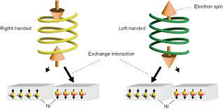

My name is Maria-Cristina Ghetu and I am a PhD student in [The Haran Group](https://www.weizmann.ac.il/chembiophys/cfharan/home) at the Weizmann Institute of Science.

My ongoing research centers on exploring how electron spin influences various bio-related interactions, spanning from protein-protein associations to enzyme kinetics. Recent advancements in understanding the chiral induced spin selectivity (CISS) effect highlight the potential of manipulating electron spin, despite its complexities, to innovate new bio-based materials, enhance existing processes, and deepen our comprehension of structure-property relationships within chiral molecules.

    

